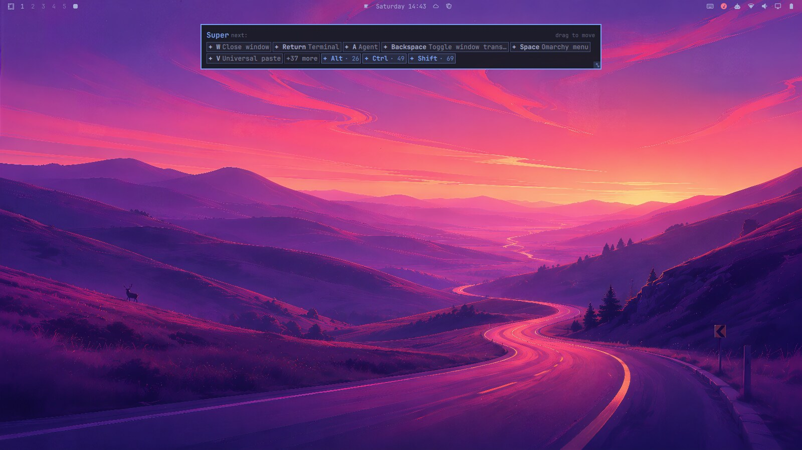
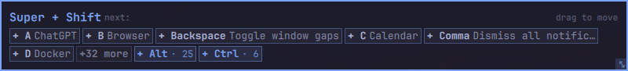
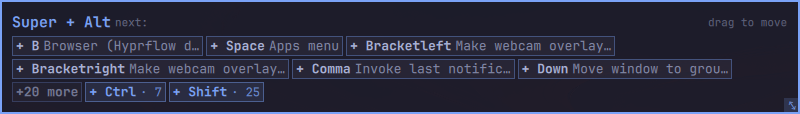
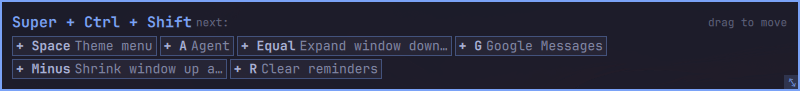
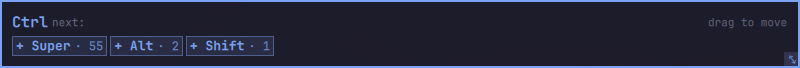

<div align="center">

# Hotkey Hints

**Hold a modifier. See what it can do.**

A which-key style hotkey cheatsheet for [Omarchy](https://omarchy.org): hold
**Super**, **Alt**, **Ctrl** or **Shift** anywhere on the desktop and a small
card shows every hotkey that branches off it. It's read live from your own
keybindings, so it's never out of date.

[](https://omarchy.org)
[](https://hyprland.org)
[](https://quickshell.org)
[](LICENSE)
[](CONTRIBUTING.md)


</div>

## Why

Omarchy ships with *hundreds* of hotkeys, and your own `bindings` grow on top
of that. Nobody remembers them all, and opening a keybindings menu breaks your
flow. Hotkey Hints answers "what does Super do again?" without you ever leaving
the keyboard: hold the key you're already reaching for and the answer appears
next to your work.

- **Progressive disclosure.** Only the keys that *complete* a combo are shown,
  plus the deeper branches (`+ Ctrl · 12`). Add another modifier while holding
  to drill one level deeper. The rest collapses into a `+N more` chip.
- **Always accurate.** Built from `omarchy menu keybindings --print`, so it
  reflects your actual config, including your own custom bindings.
- **Never steals focus.** The card takes no keyboard focus at all, so you can
  keep typing in whatever window you were in.
- **Never flashes.** A 280 ms delay means capital letters and quick shortcuts
  don't trigger it.
- **Closes the instant you let go.** Release is read from the kernel, not the
  compositor. That's the one thing Hyprland can't tell a plugin (see
  [How it works](#how-it-works)).
- **Learns what you use** (optional). Your most-pressed hotkeys float to the
  front.
- **Movable and themable.** Drag it anywhere, resize it from the corner grip,
  and set the font, padding, position and opacity live.

<p align="center">
  
</p>

### Drill down

<table>
  <tr>
    <td><b>Super + Shift</b><br></td>
  </tr>
  <tr>
    <td><b>Super + Alt</b><br></td>
  </tr>
  <tr>
    <td><b>Super + Ctrl + Shift</b><br></td>
  </tr>
  <tr>
    <td><b>Ctrl</b>: only branches, no direct combos<br></td>
  </tr>
</table>

## Requirements

| | |
|---|---|
| Omarchy | 4+ (the Quickshell-based shell) |
| Package | `python-evdev` |
| Group | your user must be in the `input` group |

Both exist for one reason: Hyprland never delivers a *release* event for a bare
modifier key, so the plugin reads key transitions from the kernel instead. That
needs read access to `/dev/input`, which the `input` group grants. **No root, no
system service, no setuid** — see [Privacy](#privacy-what-is-actually-read)
below for exactly what is read.

## Install

```sh
# 1. the evdev binding used to read key transitions
omarchy pkg add python-evdev        # or: pacman -S python-evdev

# 2. read access to /dev/input
sudo usermod -aG input "$USER"

# 3. the plugin itself
omarchy plugin add https://github.com/justarieldotcom/omarchy-hotkey-hints --enable
```

**Then log out and back in.** Group membership only applies to a new login
session, and the plugin's key watcher is started by the shell, so it inherits
the session's groups. Until you do, the settings popup will tell you the
watcher can't read the keyboard.

Verify it came up:

```sh
omarchy-shell justarieldotcom.hotkey-hints status     # -> running
```

Then just hold Super.

## Uninstall

```sh
omarchy plugin remove justarieldotcom.hotkey-hints
```

That stops the watcher (it is a child of the shell and cannot outlive it),
unloads the overlay and removes the bar icon. Nothing is left running and
nothing outside the plugin folder was ever installed.

Two small state files are deliberately left behind, so reinstalling keeps your
settings and usage history. Delete them for a clean slate:

```sh
rm -f ~/.local/state/omarchy/hotkey-hints-usage.json \
      ~/.local/state/omarchy/hotkey-hints-bindings.json
```

If you no longer want any plugin reading `/dev/input`, also remove yourself
from the group: `sudo gpasswd -d "$USER" input`.

## Settings

Click the keyboard icon in the bar. Changes apply live — no restart.

| Setting | Default | What it does |
|---|---|---|
| Font family | theme font | Leave empty to follow the bar's theme |
| Font size | 13 | 9–28; also scales with the card width |
| Overlay padding | 10 | Inner padding, 4–48 |
| Position | center | Where the card first appears: top / center / bottom |
| Opacity | 0.97 | 0.3–1.0 |
| Direct combos shown per level | 6 | 2–24. Keep it low so the card stays a sliver; extras become `+N more` |
| Remember most-used hotkeys | off | Sort chips by how often you press them — see below |

**Preview (Super)** opens the card for a couple of seconds so you can see a
setting change without holding anything down.

## Remember most-used hotkeys (opt-in, off by default)

Turn this on and each level's chips are ordered by how often you actually press
that combo, most-used first. Combined with the *direct combos* cap, the hotkeys
you really use are the ones that stay on screen and the rest fall into
`+N more`.

Turning it off stops *using* the counts but keeps them, so switching back on
doesn't have to relearn anything. **Reset usage stats** clears them.

## Privacy: what is actually read

This plugin reads your keyboard. Here is precisely how much, and what stops it
being more.

**Always:** the eight modifier keycodes (both Super, Ctrl, Alt and Shift keys)
and nothing else. A press or release of one of those produces a single line —
`press SUPER` — for the overlay. That is the whole feature.

**Only with *Remember most-used hotkeys* on:** the watcher also notices a
non-modifier key going down *while a modifier is held* — a completed hotkey.
Before anything is reported, that combination is matched **inside the watcher
process** against the list of your currently-bound hotkeys (which the overlay
writes to `hotkey-hints-bindings.json` from the same `omarchy menu keybindings`
output it draws the hints from).

**No match, nothing happens.** Not reported, not logged, not written, not
counted. Ordinary typing, an application's own Ctrl+C, any unbound
combination — all dropped inside the watcher before leaving it. That
match-before-report order is the entire reason a helper that sees regular key
events is not a keylogger, and it is the thing to check if you audit this code:
see `on_key()` in `hotkey-watcher.py`.

**What a match produces** is just the identity, e.g. `SUPER:K`, counted in
`~/.local/state/omarchy/hotkey-hints-usage.json`. Never which window had focus,
never timing, never key sequences, never anything about a key that wasn't one of
your own bound hotkeys.

Nothing is ever sent anywhere. The plugin makes no network requests of any
kind, and both state files are plain JSON you can read.

Being in the `input` group is a real privilege — it lets *any* program you run
read the keyboard. This plugin needs it because Hyprland won't report modifier
releases. If that trade isn't one you want to make, this plugin isn't for you,
and removing yourself from the group is a one-liner (above).

## How it works

| File | Role |
|---|---|
| `Overlay.qml` | The card (`panel` kind, always loaded, no bar icon). Launches and supervises the watcher, reads its stdout, draws the hints. |
| `hotkey-watcher.py` | Unprivileged evdev helper. Prints one line per modifier transition. Wrapped in `setpriv --pdeathsig TERM`, so it dies with the shell. |
| `Widget.qml` | The bar icon, which exists only to host the settings popup — the one mechanism Omarchy gives third-party plugins for live, persisted settings. |
| `Model.js` | Pure parsing and the progressive-disclosure logic. No QML imports, so it is testable on its own. |

Settings live in this plugin's inline entry in `~/.config/omarchy/shell.json`;
`Overlay.qml` watches that file directly, which is why changes apply live.

Developer notes, including why the kernel has to be read at all, are in
[`docs/DEVNOTES.md`](docs/DEVNOTES.md).

## Troubleshooting

**The card never appears.** Check `omarchy-shell justarieldotcom.hotkey-hints
status`:

| Status | Meaning |
|---|---|
| `running` | Watcher is fine — if the card still won't show, hold the key a little longer than 280 ms |
| `no-input-access` | Not in the `input` group yet, or you haven't logged out and back in since |
| `missing-evdev` | Install `python-evdev` |
| `no-keyboard` | No keyboard device found (unusual — a container or an unplugged external-only setup) |
| `failed` | Crashed unexpectedly; it retries with backoff |

After fixing a setup problem, use **Retry watcher** in the settings popup
instead of restarting the shell.

**It opens on the wrong monitor.** It follows Hyprland's focused output. If
that looks wrong, check `hyprctl monitors`.

## Contributing

This plugin is small, readable, and deliberately split so each piece is easy
to hack on: pure logic in `Model.js` (testable under plain `node`), the UI in
`Overlay.qml`, and a ~330-line Python helper. Forks and PRs are very welcome.

Some ideas that would make it better:

- **Search / filter** inside the card while it's open
- **Themes that follow Omarchy's current theme** colors automatically
- **Other keybinding sources**: the evdev watcher and `Model.js` don't care
  where bindings come from; only the `omarchy menu keybindings` parse is
  Omarchy-specific
- **Leader-key / submap awareness** for Hyprland submaps
- **Per-app hints**: show an application's own shortcuts when it's focused
- **Tap-to-pin**: keep the card open after release for a proper read
- **Translations** of the UI strings

See **[CONTRIBUTING.md](CONTRIBUTING.md)** for the dev setup, how to test each
piece, and the few design rules that keep this plugin trustworthy. Found a bug
or have an idea? [Open an issue](https://github.com/justarieldotcom/omarchy-hotkey-hints/issues/new/choose).
If you build something cool on a fork, open a PR or tell me about it.

## License

MIT — see [LICENSE](LICENSE).

## Author

**justarieldotcom** · [@justarieldotcom on X](https://x.com/justarieldotcom)
